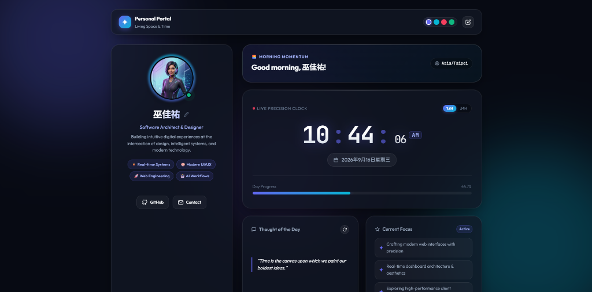

# 916testproject

A modern, responsive personal dashboard and profile page featuring a live real-time clock, dynamic greeting, day progression tracker, and customizable profile widgets.

## Live Demo

🔗 **Live Demo:** [https://stevenwujr.github.io/916testproject/](https://stevenwujr.github.io/916testproject/)

## Features

- **Live Precision Clock**: High-precision hours, minutes, and seconds readout with 12H / 24H format toggling.
- **Time-of-Day Greeting**: Automatically updates greeting and icon based on local time and time zone.
- **Day Progression Tracker**: Real-time visual progress bar tracking the percentage of the 24-hour day elapsed.
- **Profile Customization**: Click-to-edit display name, role, and bio with instant `localStorage` persistence.
- **Modern Glassmorphism Aesthetic**: Multi-layered frosted glass cards, subtle luminous borders, ambient lighting orbs, and theme color swatches.
