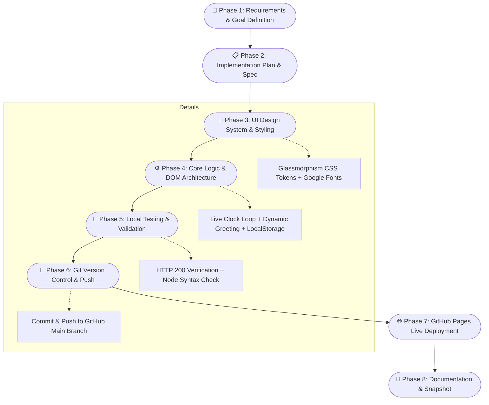

# DIC 1: Personal Portal & Live Precision Dashboard

> **Course Assignment**: DIC 1 (Do In Class 1)  
> **Student / Author**: 巫佳祐 (Steven Wu)  
> **Repository**: [stevenwujr/916testproject](https://github.com/stevenwujr/916testproject)  
> **Live Demo**: [https://stevenwujr.github.io/916testproject/](https://stevenwujr.github.io/916testproject/)

---

## 🌐 Live Demo & Preview

🔗 **Experience the Live Web Application:**  
**👉 [https://stevenwujr.github.io/916testproject/](https://stevenwujr.github.io/916testproject/)**


---

## 📌 Project Overview

This project was developed during **DIC 1 (Do In Class 1)** as a comprehensive hands-on practice in modern front-end web engineering, AI-assisted pair programming, and automated Git/GitHub Pages deployment.

The application is an ethereal, cyber-glassmorphism personal portal featuring:
- A prominent, customizable profile card with instant inline editing.
- A high-precision live digital clock with 12H / 24H switching.
- Dynamic time-of-day greetings synchronized with the client's local timezone.
- An animated 24-hour day progress bar.
- Interactive widgets (daily inspiration quotes and active learning focuses).
- Multiple neon accent themes with client-side persistence via `localStorage`.

---

## 🔄 Project Workflow

The development lifecycle for this project followed a structured modern engineering pipeline:



### Detailed Workflow Steps

1. **Requirement Analysis & AI Alignment**:
   - Specified core deliverables: personal name display, real-time clock, responsive layout, and modern aesthetics.
   - Formulated an implementation plan with clear architectural boundaries.

2. **Design System & Visual Styling (`style.css`)**:
   - Established CSS custom properties (`:root`) for dynamic accent switching (`indigo`, `cyan`, `rose`, `emerald`).
   - Implemented frosted glassmorphism using `backdrop-filter: blur(20px)` and floating ambient light orbs.
   - Loaded modern typography: [Outfit](https://fonts.google.com/specimen/Outfit) for headings and [JetBrains Mono](https://fonts.google.com/specimen/JetBrains+Mono) for tabular clock numerals.

3. **Component & Logic Construction (`index.html` & `script.js`)**:
   - Structured semantic HTML5 tags (`<header>`, `<main>`, `<section>`, `<footer>`, `<dialog>`).
   - Built a 1000ms real-time clock loop calculating hours, minutes, seconds, and elapsed day percentage.
   - Integrated dynamic daytime greetings (`Morning Momentum`, `High Productivity`, `Golden Twilight`, `Midnight Focus`).
   - Added modal profile editing with real-time DOM reflection and `localStorage` persistence.

4. **Testing & Verification**:
   - Validated static assets (`index.html`, `style.css`, `script.js`, `avatar.jpg`) via local Python HTTP server (`200 OK`).
   - Executed static JavaScript syntax analysis (`node -c script.js`).

5. **Deployment & Release**:
   - Initialized Git repository, committed codebase, and pushed upstream to GitHub.
   - Activated GitHub Pages for global public access.
   - Documented the repository and embedded live snapshots.

---

## ✨ Key Features

| Feature | Description |
| :--- | :--- |
| ⏱️ **Live Precision Clock** | High-precision digital display with pulsing colon separators, seconds segment, and 12-hour / 24-hour mode toggling. |
| 🌅 **Dynamic Greeting** | Greets the user based on the current hour (e.g., *"Good morning, 巫佳祐!"*) with contextual status badges and auto-detected timezone. |
| 📊 **Day Progress Bar** | Calculates elapsed seconds out of 86,400 to show the exact percentage of the current day completed. |
| 👤 **Profile Customization** | Allows instant renaming and title editing via an interactive modal, saved locally in browser storage. |
| 🎨 **Theme Switcher** | Switch between 4 curated neon color palettes (Indigo, Cyan, Rose, Emerald) in real time. |
| 💡 **Interactive Widgets** | Includes a cycle-able "Thought of the Day" quote widget and a "Current Focus" checklist. |

---

## 🛠️ Technology Stack

- **Markup**: HTML5 (Semantic elements, accessibility ARIA attributes)
- **Styling**: Vanilla CSS3 (Custom properties / variables, Flexbox, Grid, Keyframe animations, Glassmorphism)
- **Scripting**: Modern JavaScript ES6+ (`Intl.DateTimeFormat`, DOM APIs, `localStorage`, `setInterval`)
- **Typography**: Google Fonts (*Outfit*, *JetBrains Mono*)
- **Hosting & CI/CD**: GitHub Pages & Git CLI

---

## 📂 Project Structure

```text
916testproject/
├── index.html       # Main semantic HTML structure & layout
├── style.css        # Design tokens, themes, glassmorphism & responsive rules
├── script.js        # Real-time clock engine, greeting logic & local state
├── avatar.jpg       # Profile avatar artwork
├── snapshot.png     # Application screenshot for demonstration
└── README.md        # Project documentation & homework summary
```

---

## 🚀 Running Locally

To run and preview the project on your local machine:

1. Clone or download this repository:
   ```bash
   git clone https://github.com/stevenwujr/916testproject.git
   cd 916testproject
   ```

2. Start a local HTTP server (e.g., using Python):
   ```bash
   python -m http.server 8088
   ```

3. Open your browser and visit:
   ```text
   http://localhost:8088
   ```
   *(Or simply open `index.html` directly in any modern web browser).*

---

## 🎓 Summary of Today's Work (DIC 1 Reflection)

1. **AI-Assisted Full-Stack Prototyping**: Successfully translated high-level user prompts into a production-ready, aesthetically stunning web application within minutes.
2. **Modern CSS & UX Mastery**: Implemented modern web design techniques including glassmorphism, responsive grid layouts, and dynamic theme switching without relying on third-party frameworks.
3. **State Management & Persistence**: Learned client-side state handling with vanilla JavaScript and persistent browser storage (`localStorage`).
4. **Git & GitHub Pages Workflow**: Completed the entire loop from code generation to version control (`git add`, `git commit`, `git push`) and live deployment on GitHub Pages.
